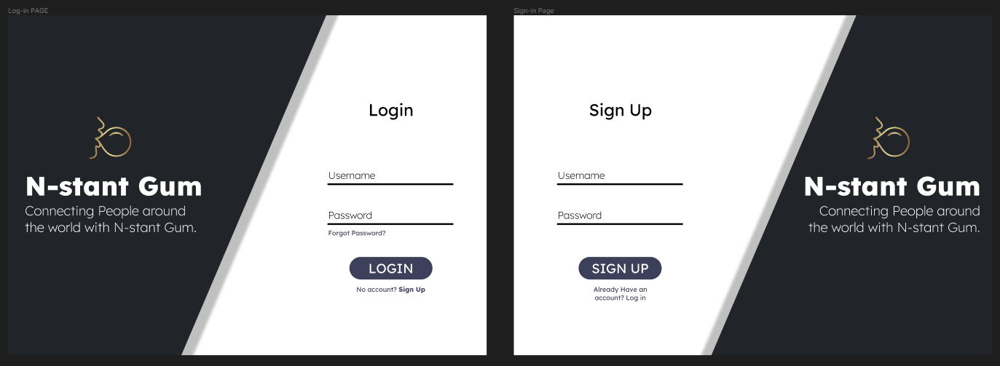
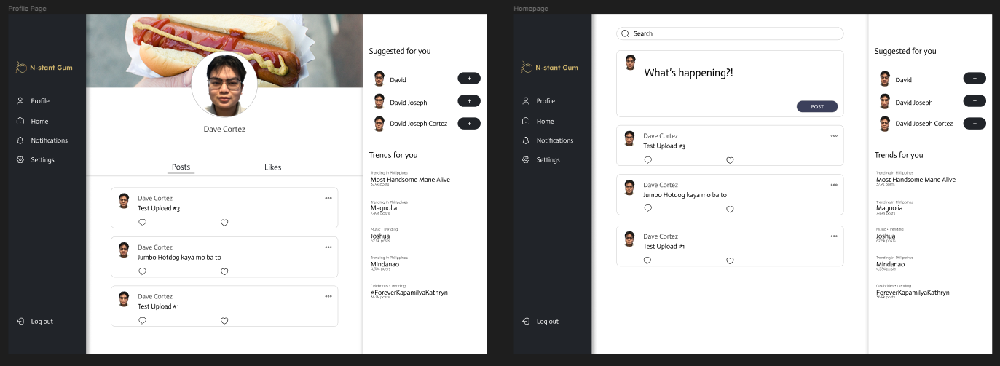
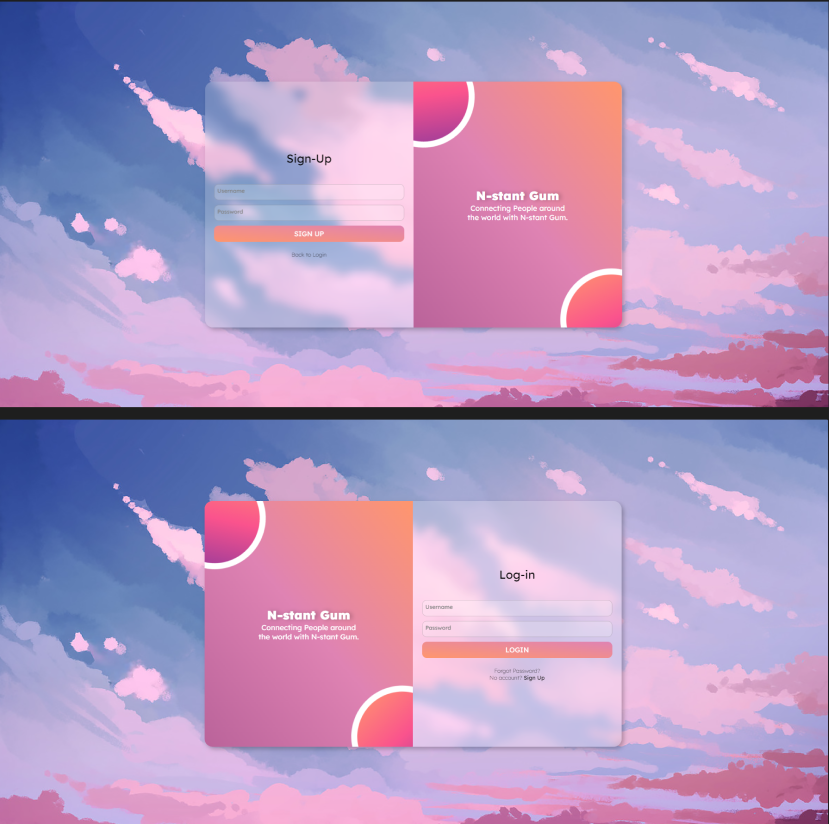

# Twitter Clone

## Figma Concept

## Final Design

## Where could the concepts discussed in class be seen in your website?
Our website's structure adheres to the basic HTML document format with files like homepage.html and profile.html. Semantic HTML elements such as header, nav, main, section, aside, and footer are used to organize content meaningfully. Navigation links (<a> tags) facilitate page transitions within the website.

Forms containing input elements like text fields and buttons enable functionalities such as searching and making posts. CSS selectors, including element, class, and ID selectors, are utilized for styling, alongside properties like margin, padding, and border for layout control.

Flexbox is employed for flexible and responsive layout design, particularly evident in navigation and sidebar layouts. Media queries ensure responsiveness across different screen sizes. JavaScript event handling, such as onclick and onsubmit, triggers functions for interactivity like making posts and logging out.

Dynamic DOM manipulation updates content based on user actions or changing states, such as displaying user-specific profile information. JavaScript adds interactivity features like liking posts, user authentication, and toggling element visibility, enhancing user engagement.

## What was your inspiration for the design of the website?
Our concept for the website design was to merge Instagram and Twitter. We wanted to follow the simplicity and use of Instagram's UI. We were inspired by the growing trend of social media users desiring more streamlined experiences in which they can easily share memories and keep updated all in one spot.
## What was your approach in creating the content of the website?
Our content creation approach was iterative and collaborative, beginning with outlining key features based on user needs. Brainstorming and wireframing in Figma established the website's structure. After establishing the layout with HTML/CSS, we focused on crafting engaging content, including visuals and text-based elements like captions and user profiles.

## How is your website creative?
Our website emphasizes creativity across various elements, starting with visually stunning design featuring custom graphics, vibrant color palettes, and thoughtful typography. Dynamic layout designs enhance interactivity and immersion, including interactive features like liking posts and intuitive navigation menus. Prioritizing user experience, we ensure clear content presentation and intuitive navigation flows, complemented by personalized features for individual users. Content presentation utilizes multimedia and interactive elements to engage visitors, while innovative features and design concepts push the boundaries of web design, delivering a memorable experience.

## What did you use to deploy your website?
We use Netlify to deploy our website.

## How did you divide the tasks between the team, and what is the responsibility of each one?
The team divided tasks based on expertise and project needs. Three members focused on UI design layout, responsible for crafting visual aesthetics, the user experience, and creating mockups using design tools. Two members were assigned to API implementation, responsible for creating functions to enable website functionality. Communication and collaboration ensured alignment between UI design and API implementation for a cohesive final product.

## How did you prevent your changes in code from conflicting with each other?
To prevent conflicts in our codebase, we emphasized clear communication among team members, ensuring everyone understood their tasks and responsibilities. Establishing a structured workflow, we prioritized regular commits and pushes to our GitHub repository, facilitating seamless tracking of individual contributions and minimizing the risk of conflicts. Thorough code reviews and testing were conducted to catch discrepancies early on and resolve them collaboratively. Through effective communication and disciplined version control practices, we successfully managed to maintain a cohesive codebase and prevent conflicts.

## How you could improve your website in the future
In the future, we aim to enhance our website by introducing advanced features like real-time notifications and a more robust search engine, fostering increased user engagement. Optimizing for diverse devices and screen sizes will ensure accessibility and seamless experiences. Regularly seeking user feedback and conducting usability tests will provide valuable insights for continuous improvement. By staying responsive to user needs and technological advancements, we'll maintain relevance and deliver exceptional user experiences over time.

